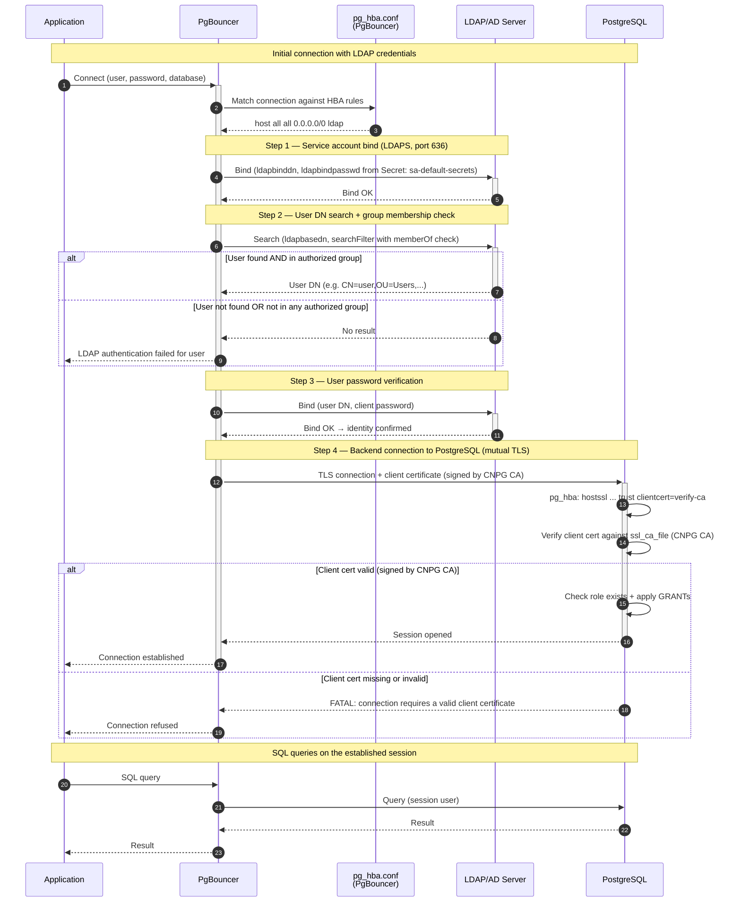
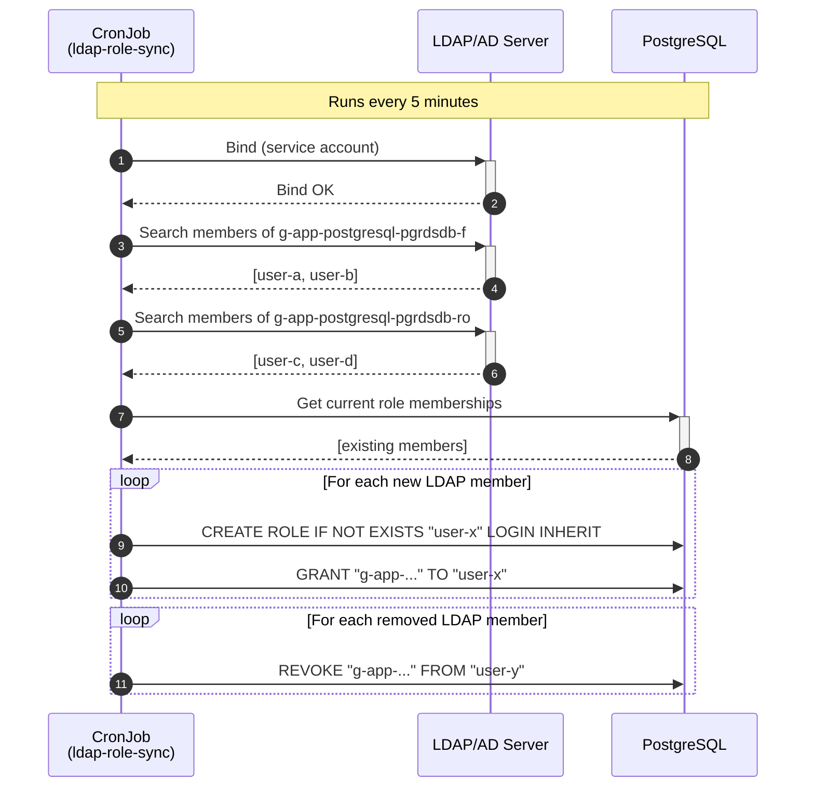

# Sequence Diagram — LDAP Authentication (Application → PostgreSQL)

This diagram describes the authentication flow of an **application** connecting to PostgreSQL via PgBouncer with LDAP authentication (*bindSearchAuth* mode).

## Actor legend

| Actor | Role |
|-------|------|
| **Application** | Client (business app) sending user / password / database |
| **PgBouncer** | CNPG pooler; applies its own `pg_hba.conf` with LDAP rules, performs LDAP auth, opens backend session |
| **pg_hba.conf (PgBouncer)** | HBA file with `ldap` rules, generated by the CNPG operator |
| **LDAP/AD Server** | Directory that validates identity (service bind + search + user bind) over LDAPS |
| **PostgreSQL** | CNPG cluster; verifies client certificate (`clientcert=verify-ca`), checks role exists, applies GRANTs |

## Step summary

1. **Application → PgBouncer**: Connect with LDAP credentials (user + password).
2. **Service bind**: PgBouncer connects to LDAP with the service account — the same service account as the Pooler itself. The bind password is read from the Kubernetes Secret `<serviceaccountname>-default-secrets` (key: `password`). Connection is over LDAPS (port 636).
3. **Search + group check**: Look up the user's DN using `searchFilter`. The filter includes a `memberOf` clause that checks membership in `g-app-postgresql-pgrdsdb-f` (full access) or `g-app-postgresql-pgrdsdb-ro` (read-only). If the user is not in either group, the search returns no result and authentication fails.
4. **User bind**: PgBouncer verifies the password with LDAP using the found DN.
5. **Backend**: If LDAP auth succeeds, PgBouncer opens a TLS connection to PostgreSQL **as that user**, presenting its client certificate signed by the CNPG cluster CA.
6. **PostgreSQL**: Verifies the client certificate against `ssl_ca_file` (`clientcert=verify-ca`). If valid, accepts the connection. The user role must exist (created by the sync CronJob) and inherits permissions from its group role (`g-app-postgresql-pgrdsdb-f` or `g-app-postgresql-pgrdsdb-ro`). If the certificate is missing or not signed by the CNPG CA, the connection is rejected.

## LDAP Group Sync — CronJob sequence

## Security notes

- **`clientcert=verify-ca`** on the PostgreSQL `pg_hba.conf` ensures that only PgBouncer
  (holding a certificate signed by the CNPG CA) can open backend connections. Other pods
  in the cluster cannot bypass PgBouncer to access PostgreSQL directly.
- **LDAP TLS verification** (`TLS_REQCERT demand`) should be enabled to prevent MITM
  attacks on the PgBouncer → LDAP connection.
- A **NetworkPolicy** should be deployed as defense in depth to restrict network-level
  access to PostgreSQL pods.
- **LDAP group filtering** (`searchFilter` with `memberOf`) restricts authentication
  to members of authorized groups. Users outside these groups cannot connect at all.
- **PostgreSQL group roles** with `INHERIT` ensure that permissions are controlled
  centrally. A CronJob syncs LDAP group membership to PostgreSQL every 5 minutes.

Source: [ldap_authentication.md](ldap_authentication.md) — *LDAP Authentication via PgBouncer in CloudNativePG*.
